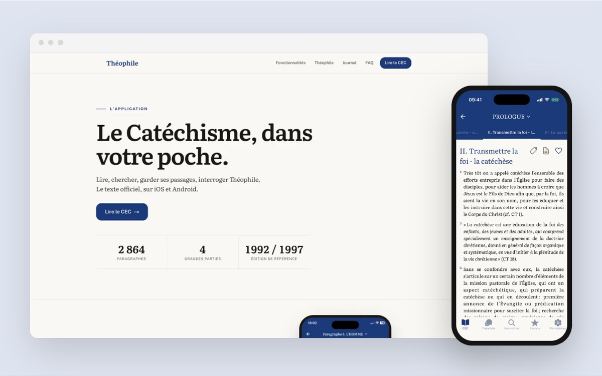
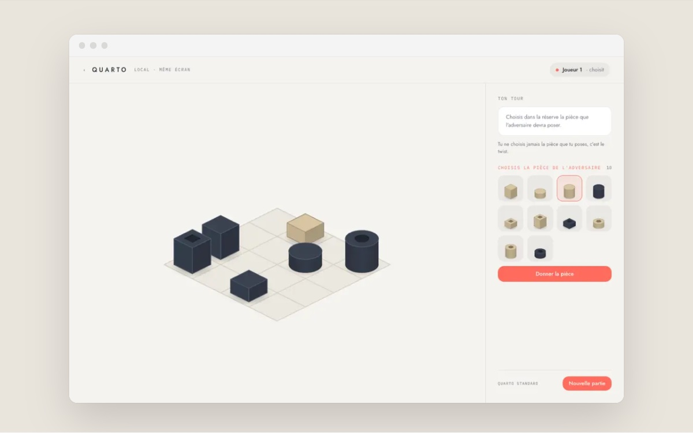
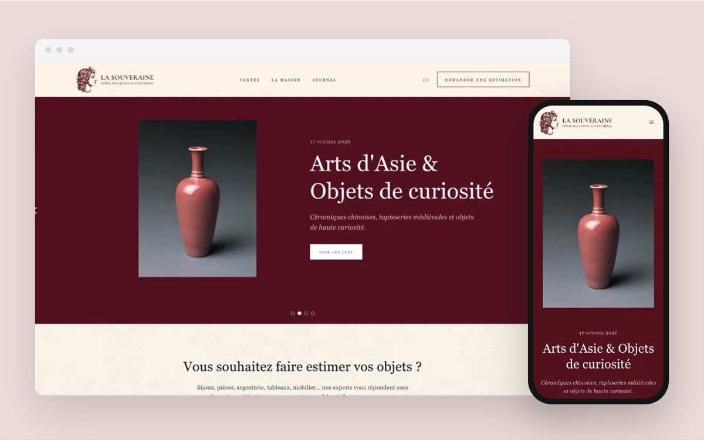
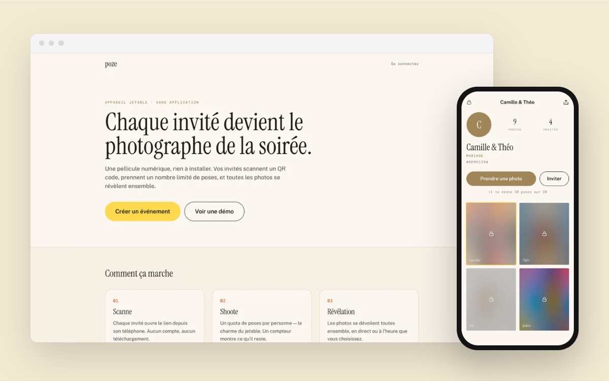
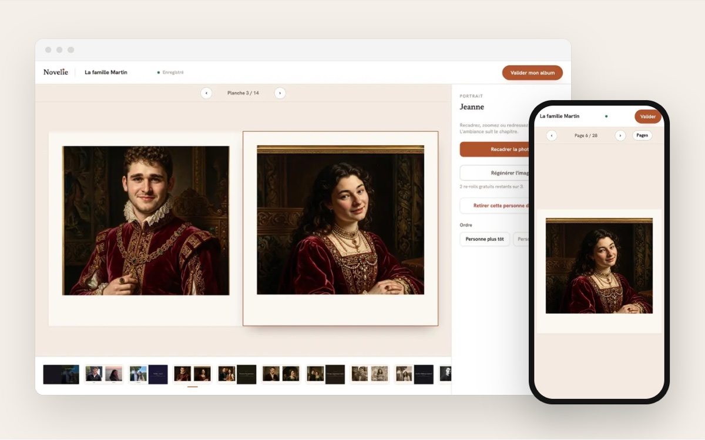
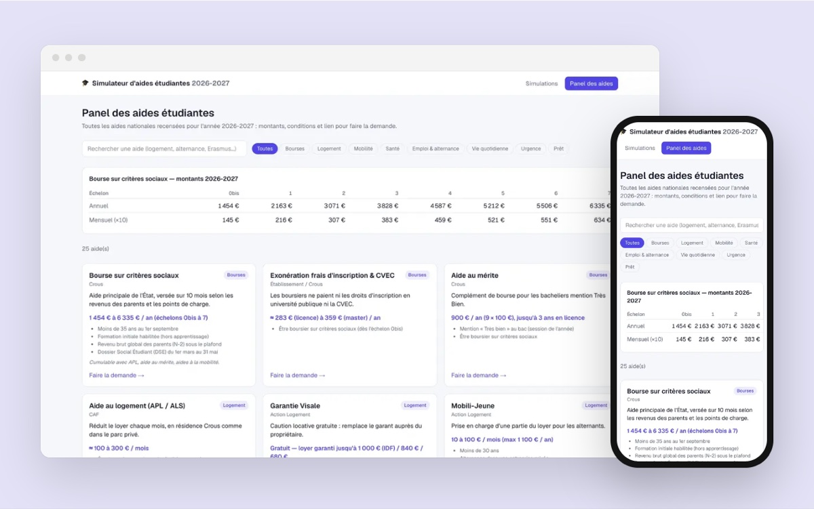
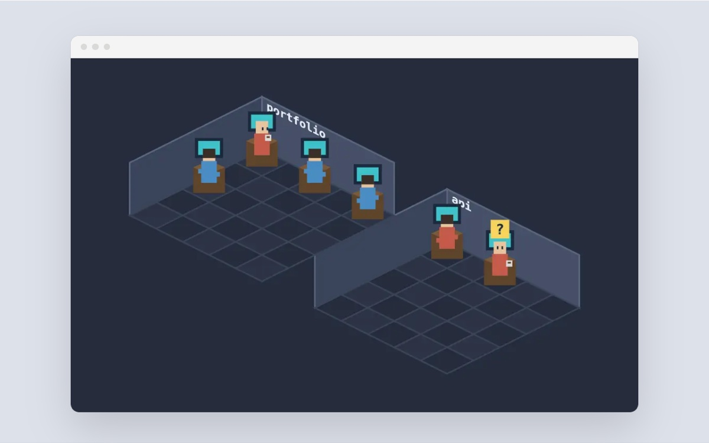
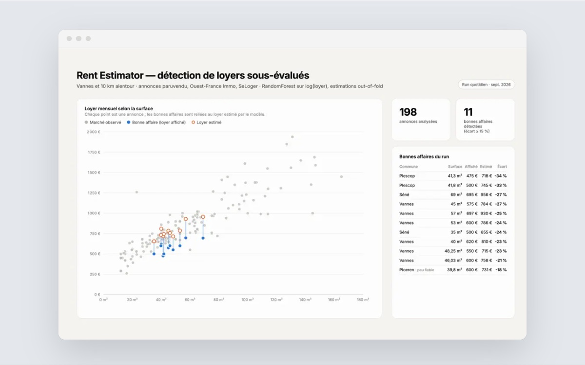

<a href="https://paul-emile-robert.fr">
  <picture>
    <source media="(prefers-color-scheme: dark)" srcset="assets/banniere-sombre.svg">
    
  </picture>
</a>

 

Je conçois et je développe des **sites** et des **applications**, seul, de la base de données à l'écran. En alternance chez Grinn Tech, TypeScript au quotidien, du web au mobile.

  <samp>
    <a href="https://paul-emile-robert.fr">portfolio</a> ·
    <a href="https://paul-emile-robert.fr/#projets">projets</a> ·
    <a href="https://www.linkedin.com/in/paul-emile-robert/">linkedin</a> ·
    <a href="https://paul-emile-robert.fr/#contact">contact</a>
  </samp>

## Projets

<table>
  <tr>
    <td width="50%" valign="top">
      
       <b>Théophile</b>
       Le Catéchisme de l'Église catholique : lire, chercher, interroger un assistant.
       Web · iOS · Android
    </td>
    <td width="50%" valign="top">
      
       <b>Quarto</b>
       Un jeu de stratégie à deux ou contre une IA en trois niveaux.
       Web · mobile
    </td>
  </tr>
  <tr>
    <td width="50%" valign="top">
      
       <b>La Souveraine</b>
       Le site d'une maison de ventes aux enchères, avec son back-office.
       Web
    </td>
    <td width="50%" valign="top">
      
       <b>poze</b>
       Un appareil photo jetable pour les mariages : les photos se révèlent ensemble.
       Web (PWA)
    </td>
  </tr>
  <tr>
    <td width="50%" valign="top">
      
       <b>Novelie</b>
       Des portraits de famille peints par IA, réunis dans un album imprimé.
       Web · en cours
    </td>
    <td width="50%" valign="top">
      
       <b>Aides étudiantes</b>
       Le simulateur des aides 2026-2027 : bourse Crous, APL, 322 aides locales.
       Web · MCP · <a href="https://github.com/paule624/aide-etudiant">code</a>
    </td>
  </tr>
  <tr>
    <td width="50%" valign="top">
      
       <b>Agent Desk</b>
       Ses sessions Claude Code d'un coup d'œil, dans un bureau en pixel art.
       Extension VS Code · <a href="https://github.com/paule624/agent-desk">code</a>
    </td>
    <td width="50%" valign="top">
      
       <b>rent-estimator</b>
       Repère chaque matin les locations sous le prix du marché.
       Python · <a href="https://github.com/paule624/rent-estimator">code</a>
    </td>
  </tr>
</table>

<a href="https://paul-emile-robert.fr/#projets">Tous les projets sur paul-emile-robert.fr →</a>

## Pile

<samp>TypeScript · React · Next.js · TanStack Start · Expo · React Native · PostgreSQL · Drizzle</samp>
